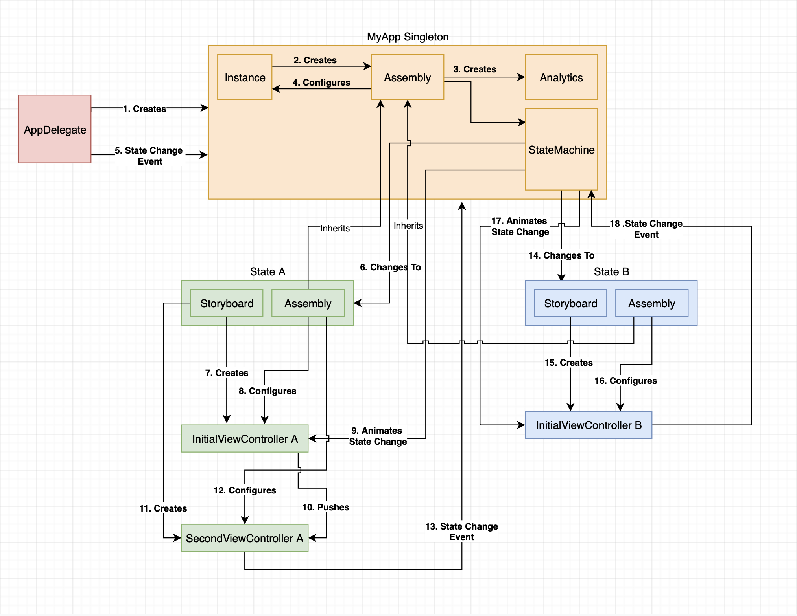

# SwinjectStateMachine-Demo

[](https://travis-ci.org/0xPr0xy/SwinjectStateMachine)

## Installation

Checkout this repository and run

```
pod install
```

## Information

This is a demo of applying `SwinjectStateMachine` to accomplish automatic dependency injection in `UIViewController`.


### Why would I need SwinjectStateMachine
Regular use of `SwinjectStoryboard` without a statemachine will result in `AppDelegate` and `UIViewController` having knowledge about the various `Assemblies` and `UIStoryboards`. We could create routers, but that will result in a lot of logic managing state. Using a statemachine centralizes the routing and business logic while following the open closed principle.

In the `SwinjectStateMachine` library the following is abstracted away:

- Owning a global Assembly for your application scoped dependencies
- Creating storyboards
- Transitioning to the initial ViewController for that state
- Evaluation of state transition rules

In a state I abstract away the following:

- Providing the dependencies (Assemblies) for that state
- Providing the name of the Storyboard

In an event I abstract away the following:

- Choosing the initial ViewController
- Choosing the state transition animation to that initial ViewController


### Architecture diagram using 2 example states (A & B)


### The example application statemachine diagram


## Author

Peter IJlst, 0xPr0xy@gmail.com

## License

SwinjectStateMachine-Demo is available under the MIT license. See the LICENSE file for more info.